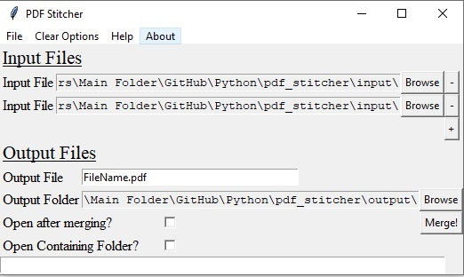

## PDF Stitcher Overview

    The PDF stitcher software is very simple. Do you have 2 or more password free PDF files? Do you you want to combine them together into a single PDF? Fantastic, you can use PDF Stitcher. 

## PDF Stitcher

This GUI is pretty simple. Download the “stitcher.exe” program, and the “SupportFiles” folder. Then, you can run this program. A help file is included with the program. 

In short, add files using the “input” portion of the program. Customize and output location using the “output” portion of the program. Then, hit “merge”. 

## This program has a number of dependencies. 

1. PY2PDF
2. ToolTip.py 
3. PopupMenu.py
4. Highlight.py
5.  Tkinter
6. Os
7. DateTime

## Stitcher, how it looks
